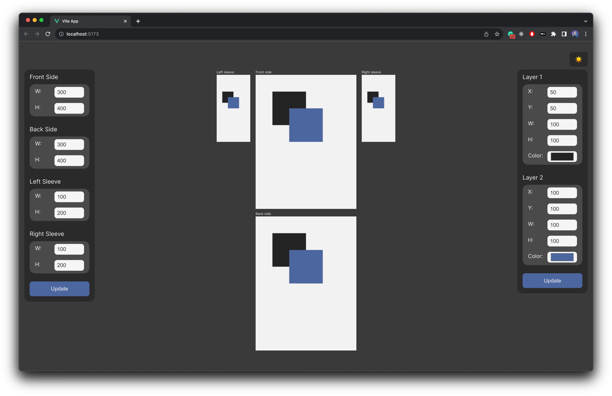

# 092023 Test Task

This repository contains the codebase for the test task dated 09/2023.
The project is developed using Vue 3 and Vite.

## Project Overview



The project is a Vue application that demonstrates the logic for recalculating positions.
It's designed to showcase best practices, efficient coding techniques, and modern development patterns.

## Getting Started

### Prerequisites

- Node.js
- npm

### Installation

1. Clone the repository:

```bash
git clone https://github.com/catherineriver/092023-test-task.git
```

2. Navigate to the project directory:

```bash
cd 092023-test-task
```

3. Install the required dependencies:

```bash
npm install
```

## Development

To start the development server with hot-reloading:

```bash
npm run dev
```

## Building for Production

To compile and minify the project for production:

```bash
npm run build
```

## Recommended IDE Setup

It's recommended to use [VSCode](https://code.visualstudio.com/) with the following extensions for the best development
experience:

- [Volar](https://marketplace.visualstudio.com/items?itemName=Vue.volar) (Make sure to disable Vetur)
- [TypeScript Vue Plugin (Volar)](https://marketplace.visualstudio.com/items?itemName=Vue.vscode-typescript-vue-plugin)

## Configuration

For custom configurations, refer to the [Vite Configuration Reference](https://vitejs.dev/config/).